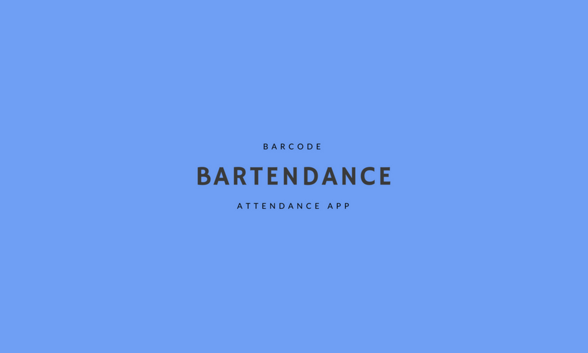
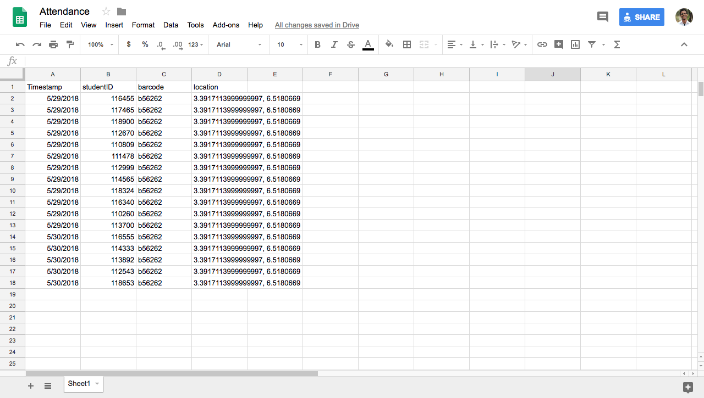
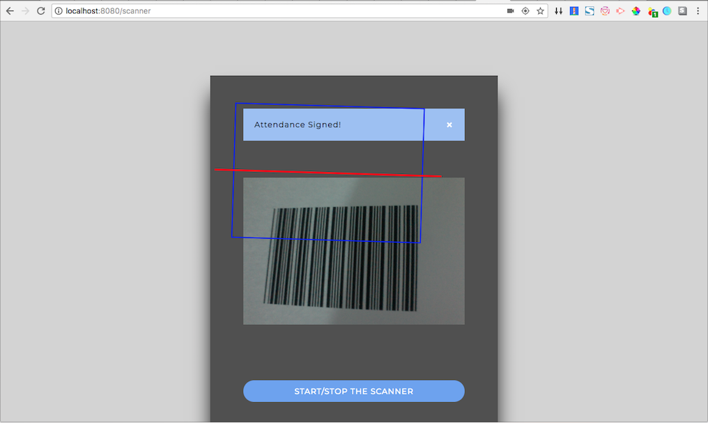

# Bartendance

  
Bartendance is a web application that takes down students’ attendance using barcode. To use, students will be required to naviagte to the web application and sign up/login. For attendance to be taken, each student is required to scan a barcode which will be displayed by the Professor. When the barcode has been scanned the student will be marked present and his/her information will be sent to a Google Spreadsheet serving as an attendance sheet.

The barcode, location and timestamp column in the attendance sheet will serve as proof that the student scanned the appropriate barcode and indeed attended the required class.

### Demo

  
## Installation

If you would like to download the code and try it for yourself:

1. Clone the repo: `git@github.com:mcndubuisi/bartendance.git`
2. Install packages: `npm install`
3. Change out the database configuration in config/database.js
4. Launch: `node server.js`
5. Visit in your browser at: `http://localhost:8080`
