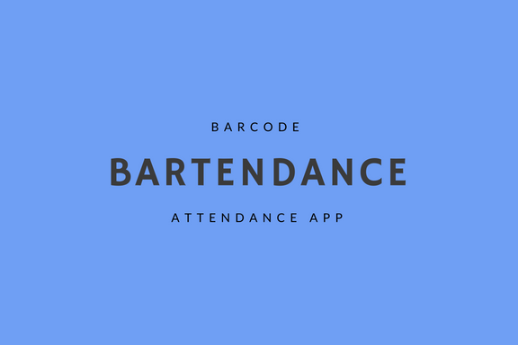

# bartendance

Bartendance is a web application that takes down students’ attendance using barcode. To use, students will be required to naviagte to the web application and sign up/login. For attendance to be taken, each student is required to scan a barcode which will be displayed by the Professor. When the barcode has been scanned the student will be marked present and his/her information will be sent to a Google Spreadsheet. The spreadsheet will serve as an attendance sheet.

The barcode, location and timestamp column in the attendance sheet will serve as proof that the student scanned the appropriate barcode and indeed attended the required class.

